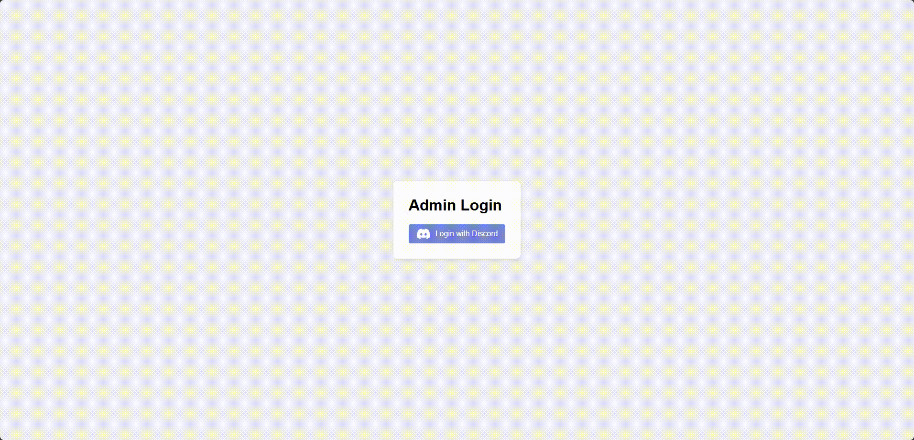

# LinkForge: Multi-Service Link Monetization API



LinkForge is a versatile Node.js API that integrates multiple link monetization services, including Linkvertise and LootLabs, to help content creators and developers generate revenue through link shortening and content locking.

## Features

- Support for multiple link monetization services:
  - Linkvertise
  - LootLabs
  - Chained links (combining multiple services)
- Rate limiting to prevent abuse
- Simple anti-bypass protection
- Discord webhook integration for notifications and analytics
- Key generation and management system
- Express.js-based API with modular architecture
- Key validation endpoint
- Admin dashboard with Discord OAuth2 authentication
- Advanced key management features (create, delete, add time, search)

## Getting Started

### Prerequisites

- Node.js (v14 or later recommended)
- MongoDB

### Installation

1. Clone the repository:

   ```bash
   git clone https://github.com/tozxart/LinkForge-Multi-Service-Link-Monetization-API
   ```

2. Install dependencies:

   ```bash
   npm install
   ```

3. Set up environment variables:

   - Rename `.env.example` to `.env`
   - Fill in the required credentials and settings, including:
     - API configuration
     - MongoDB URI
     - Linkvertise and LootLabs API tokens
     - JWT secret
     - Discord OAuth2 credentials
     - Allowed Discord user IDs for admin access
     - Base URL and webhook URLs

4. Start the server:
   ```bash
   npm start
   ```

## Usage

The API provides several endpoints for creating and managing monetized links:

- `/link/create`: Displays the link generation interface
- `/link/create-with-type`: Creates a new monetized link
- `/link/:type/:checkoutKey`: Handles link redirection and key generation
- `/key/validate/:key`: Validates a generated key

### Admin Dashboard

Access the admin dashboard at `/admin/login`. Use Discord OAuth2 to log in with an authorized Discord account.

Features:

- View all generated keys
- Create new keys (free or paid)
- Delete keys
- Add time to existing keys
- Filter and search keys

### Key Management

The system now supports advanced key management:

- Free keys expire after 24 hours
- Paid keys have customizable durations
- Admins can add time to existing keys

### Key Validation

To check if a key is valid, send a GET request to `/key/validate/:key`, replacing `:key` with the actual key you want to validate. The API will respond with a JSON object indicating whether the key is valid or not.

## Contributing

Contributions are welcome! Please feel free to submit a Pull Request.

## License

This project is licensed under the MIT License - see the [LICENSE](LICENSE) file for details.

## Acknowledgements

- [Linkvertise](https://linkvertise.com/)
- [LootLabs](https://lootlabs.gg/)
- [Express.js](https://expressjs.com/)
- [Discord.js](https://discord.js.org/)

## Disclaimer

This project is for educational purposes only. Make sure to comply with the terms of service of all integrated platforms when using this software.
